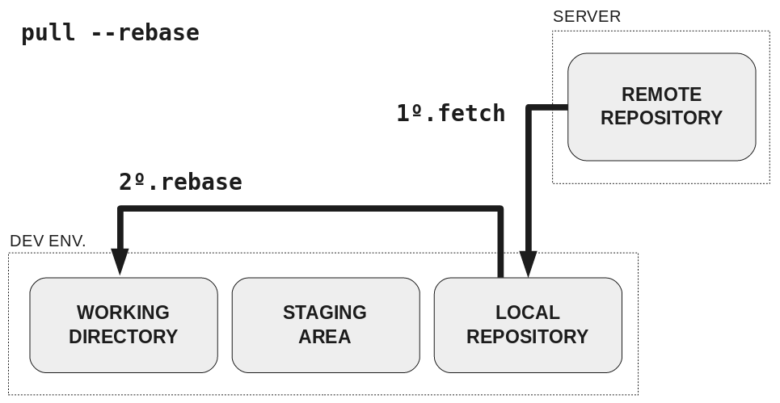

# Getting Started

When first getting started with Git it is useful to first understand the core 
concepts and workflows related to Git and Version Control Systems. 

Here I will first look at those core concepts and workflows and then follow up 
with a more in-depth dive into the individual components that build the Version Control System.

## Core Concepts and Workflows

At its core Git is merely a content magement system build off of comprehensive 
indexing the history, changes, and metadata surrounding the evolutionof those 
changes over time for a specific project, dataset, or directory of content. 

## Distributed Version Control System

It is important to realize that a **distributed version control system** is the backbone of the fundamental Git workflow. To understand further imagine separating your project into two main environments:  

- The *Dev Environment* - This is where you work on your project locally     and develop new code, data, functions, etc.
- The *Remote or Server Environment* - This is a remote repository that    mirrors and tracks your development environment using Git. 

***

***

#### The Development Environment: 

  + Working Directory 
  + Staging Area and Index 
  + Local Repository 
  
#### Server / Remote Environment: 
 
  + Remote Repository 
  
## Cloning

When cloning a remote repository, the data from the remote repository travels to two areas: 

- Working Directory 
- Local Repository 

## Making Changes

There are two types of files in the working directory: 

- Tracked: files that Git knows about.
- Untracked: files that have still not been added, so Git doesn’t know     about. 

## Updating the Remote Repository

As changes are ready in the working directory, they must be added in the staging 
area.

When there is a set of changes with a single purpose in the staging area, 
it’s the time to create a *commit* with a message about that purpose in the 
local repository.

When there are one or several commits in the local repository ready to be shared
with the rest of the world, they must be *pushed* to the remote repository.

The core workflow for incorporating changes from local to remote is 
**Add -> Commit -> Push**: 

You can break down the different possible states of a file in the development environment into three main categories: 

- Modified 
- Staged 
- Committed

Additionally, it is useful to be familiar with these helpful utility commands: 

- `git diff` - show the changes of a file in the working directory compared to what is currently on remote. 

- `git diff --staged` - show the changes of a file in the staging area

## Updating the Development Environment

When changes are made on the remote repository over time, either by yourself or collaborators, you will want to keep your local development environment up-to-date by **fetching**, **pulling**, and/or **rebasing** the remote repository with your local repository.

A helpful way to think about this is imagining it working like cloud storage software such as Google Drive. When a file is updated on the cloud (i.e. the remote repository) the software sync's your local version of that file to stay up-to-date with the remote file. 

Similarly, Git keeps your local environment in sync by continuously watching and tracking changes to the remote repository, but will not automatically make the changes to your local repository for you. 

### Fetching 

Fetching via `git fetch` pulls data from the *remote repository* to the 
*local repository*. 

### Pulling

When executing `git pull`, the data from remote repository travel to two areas:

- To local repository: `fetch` 
- To working directory: `merge` 

### Rebasing

If you take care of the commit history, consider the use of `git pull --rebase`. 

Instead of fetch + merge, it consists of fetch + rebase. 

Your local commits will be replayed and you won’t see the known diamond shape in commit history.

## Additional Concepts

- Stashing

- Branching

- Commit history

## Further Reading

- [Pro Git Book](https://git-scm.com/book/en)

Now lets take an in-depth look at git from the ground up by continuing to [Git Deep Dive](2-deep-dive.md)

